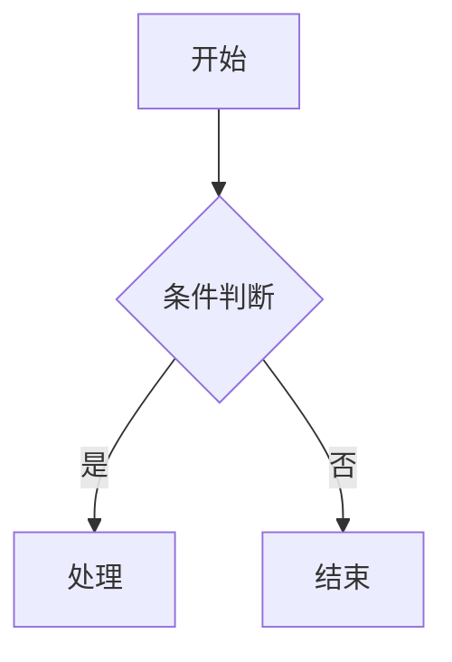

# Markdown 语法速查

> 本文件用于快速查阅 Markdown 常用语法。推荐使用 Typora、VS Code + Markdown Preview、Obsidian 等工具编辑。
> 提示：GitHub、飞书文档、Obsidian、Typora 等平台对 Markdown 的扩展语法支持略有差异，跨平台使用前先确认支持范围。

---

## 目录（TOC）

部分编辑器/平台支持自动生成目录（Typora 直接插入 `[TOC]`，VS Code 用插件，GitHub 会自动渲染标题锚点）。

---

## 1. 标题

```markdown
# 一级标题
## 二级标题
### 三级标题
#### 四级标题
##### 五级标题
###### 六级标题
```

或者使用 Setext 风格（仅支持一、二级）：

```markdown
一级标题
=======

二级标题
-------
```

---

## 2. 段落与换行

```markdown
这是第一段文字。
段落之间用空行分隔。

这是第二段文字。  
行尾加两个空格（或反斜杠 \）可以实现段内换行，
否则换行会被视为同一段落。
```

---

## 3. 强调（加粗、斜体、删除线）

```markdown
**加粗文字**          <!-- 两个星号 -->
*斜体文字*            <!-- 一个星号 -->
***加粗斜体***        <!-- 三个星号 -->
~~删除线~~            <!-- 两个波浪号，部分平台支持 -->
==高亮文字==          <!-- 高亮，部分平台支持 -->
<u>下划线</u>         <!-- 下划线，需用 HTML -->
```

实际效果：**加粗**、*斜体*、***加粗斜体***、~~删除线~~、==高亮==、<u>下划线</u>

---

## 4. 列表

### 无序列表

```markdown
- 项目一
- 项目二
  - 子项目 A
  - 子项目 B
- 项目三
```

也可以用 `*` 或 `+` 代替 `-`。

### 有序列表

```markdown
1. 第一步
2. 第二步
3. 第三步
```

> 注意：不同平台对“有序列表自动编号”的处理不一致，建议手动编号。

### 任务列表（Task List）

```markdown
- [x] 已完成事项
- [ ] 待办事项
- [ ] 另一个待办
```

效果：

- [x] 已完成事项
- [ ] 待办事项
- [ ] 另一个待办

---

## 5. 链接

```markdown
[显示文字](https://example.com "悬停提示")

[带标题的链接](https://example.com)

<https://example.com>            <!-- 自动链接 -->

[引用式链接][ref-id]
[ref-id]: https://example.com    <!-- 文末定义 -->


```

常用形式：

- 行内链接：`[GitHub](https://github.com)`
- 引用式链接：先写 `[文字][id]`，文末定义 `[id]: 链接`
- 相对路径链接（本地文档常用）：`[查看报告](./report.pdf)` 或 `[上级目录](../README.md)`
- 图片尺寸控制（仅部分平台支持）：`{:width="300px"}`（Typora）或 ``（HTML）

---

## 6. 引用（Blockquote）

```markdown
> 这是一个引用。
>
> 可以包含多个段落。
> 
> - 也可以包含列表
> - 和代码等元素
```

嵌套引用：

```markdown
> 外层引用
>> 内层引用
```

---

## 7. 代码

### 行内代码

```markdown
使用 `std::vector<int>` 声明一个向量。
```

### 代码块（围栏式）

````markdown
```cpp
#include <iostream>
int main() {
    std::cout << "Hello, World!" << std::endl;
    return 0;
}
```
````

常用语言标识：`cpp`、`c`、`python`、`java`、`javascript`、`bash`、`powershell`、`sql`、`json`、`yaml`、`xml`、`markdown`、`text`（无高亮）。

### 指定行高亮 / 文件名（部分平台支持）

````markdown
```cpp title="main.cpp" linenums="1" hl_lines="2 4"
#include <iostream>
int main() {          // 第 2 行高亮
    return 0;         // 第 4 行高亮
}
```
````

### 无语言代码块

````markdown
```
纯文本，无语法高亮
```
````

---

## 8. 表格

```markdown
| 列名一 | 列名二 | 列名三 |
| :----- | :----: | -----: |
| 左对齐 | 居中   | 右对齐 |
| 内容 A | 内容 B | 内容 C |
```

- 对齐方式：冒号在左 `:---` 左对齐，两侧 `:---:` 居中，右侧 `---:` 右对齐
- 第一行表头、第二行分隔线、后续行为数据

表格内换行：用 `<br>` 标签（HTML）。

---

## 9. 分割线

```markdown
---

***
___
```

三个及以上的 `-`、`*` 或 `_` 均可生成分割线。

---

## 10. 转义字符

在需要显示特殊字符时，用反斜杠 `\` 转义：

```markdown
\* 不是斜体开始
\# 不是标题
\` 不是代码开始
```

常用转义：`\` `*` `_` `{}` `[]` `()` `#` `+` `-` `.` `!` `|` `>` `<`

---

## 11. HTML 混排

Markdown 兼容部分 HTML 标签，可在排版受限时使用：

```markdown
<div align="center">
  <h2>居中标题</h2>
</div>

<br>              <!-- 强制换行 -->
<kbd>Ctrl</kbd> + <kbd>C</kbd>   <!-- 键盘按键 -->
<sub>下标</sub> / <sup>上标</sup>
<details>
  <summary>点击展开</summary>
  折叠内容
</details>
```

效果示例：

<kbd>Ctrl</kbd> + <kbd>C</kbd>

<details>
  <summary>点击展开详情</summary>
  这里是折叠后隐藏的内容，适合放长段说明、参考链接、补充资料等。
</details>

---

## 12. 脚注（部分平台支持）

```markdown
这是一段需要脚注的文字[^1]。

[^1]: 这是脚注的具体内容。
```

---

## 13. 数学公式（LaTeX，部分平台支持）

行内公式：`$E = mc^2$`

块级公式：

```markdown
$$
f(x) = \int_{-\infty}^{+\infty} \hat{f}(\xi)\, e^{2\pi i x \xi} \, d\xi
$$
```

---

## 14. 图表（Mermaid，部分平台支持）

```markdown

```

---

## 15. 检查清单（Checklist 汇总）

- [x] 标题
- [x] 段落与换行
- [x] 强调
- [x] 列表（无序 / 有序 / 任务）
- [x] 链接与图片
- [x] 引用
- [x] 代码（行内 / 代码块）
- [x] 表格
- [x] 分割线
- [x] 转义字符
- [x] HTML 混排
- [x] 脚注 / 公式 / 图表（扩展）

---

---

# 附录：复杂文档模板

> 以下是一个可直接复制使用的“完整项目文档”模板，整合了目录、元信息、章节、表格、代码、公式、折叠块与任务清单，适合作为 UE 项目 / 工程 / 读书笔记等长文档的骨架。

```markdown
# 项目名称：XXXX

> 项目简介：用一句话说明这个文档/项目的用途。
>
> 版本：v1.0 ｜ 作者：XXX ｜ 日期：2026-08-29

---

## 目录

- [1. 概述](#1-概述)
- [2. 环境与依赖](#2-环境与依赖)
- [3. 核心概念](#3-核心概念)
- [4. 快速开始](#4-快速开始)
- [5. 详细说明](#5-详细说明)
- [6. 常见问题（FAQ）](#6-常见问题faq)
- [7. 变更记录](#7-变更记录)

---

## 1. 概述

### 1.1 背景

一段背景说明，解释为什么需要这个项目/功能。

### 1.2 目标

- [x] 目标一：已实现的功能
- [ ] 目标二：待开发的功能

---

## 2. 环境与依赖

| 依赖项 | 版本要求 | 说明 |
| :----- | :------: | :--- |
| Unreal Engine | 5.7 | 项目目标引擎版本 |
| Visual Studio | 2022 | 编译 C++ 所需 |
| 其他工具 | - | 可选依赖 |

---

## 3. 核心概念

### 3.1 术语表

| 术语 | 缩写 | 含义 |
| :--- | :--: | :--- |
| 示例术语 | ST | 解释说明 |
| 另一术语 | OT | 解释说明 |

### 3.2 关键公式

$$
s = v_0 t + \frac{1}{2} a t^2
$$

---

## 4. 快速开始

### 4.1 安装

```bash
# 示例命令
git clone <repo-url>
cd <project-dir>
```

### 4.2 配置示例

```yaml
server:
  host: 127.0.0.1
  port: 8080
  debug: true
```

---

## 5. 详细说明

### 5.1 代码示例

```cpp
// 示例：在 UE5 中注册一个 Actor
UCLASS()
class AMyActor : public AActor
{
    GENERATED_BODY()
public:
    AMyActor();
};
```

### 5.2 关键说明（可折叠）

<details>
  <summary>点击查看补充细节</summary>

  这里放长段的补充说明、参考链接、历史决策等，避免正文过于冗长。

  - 补充点一
  - 补充点二

</details>

---

## 6. 常见问题（FAQ）

**Q：遇到问题 X 怎么办？**

A：解决方案说明。参见 [官方文档](https://example.com)。

**Q：问题 Y？**

A：解决方案说明。

---

## 7. 变更记录

| 日期 | 版本 | 变更内容 | 作者 |
| :--- | :--: | :------- | :--: |
| 2026-08-29 | v1.0 | 初稿创建 | XXX |

---

## 参考链接

- [Markdown 官方说明](https://daringfireball.net/projects/markdown/)
- [GitHub Flavored Markdown](https://github.github.com/gfm/)
- [Mermaid 图表文档](https://mermaid.js.org/)
```

---

*以上模板中所有 `XXXX`、`XXX` 等占位内容请按实际情况替换。*
