# 新的体素世界演示
**我起初是想让体素世界变得更加真实。现实世界中我们能看到各种曲面而不是像方块世界一样有着固定的90度角，原因在于粒子极其微小再加上光的各种散射折射我们肉眼感知到的就是这么“不规则的世界”。在体素世界中通过让方块足够小来达到足够欺骗肉眼的效果是不划算的，我们可以直接渲染曲面而不是用微小的方块模拟曲面。我们可以借鉴插值的思想，将两个相交的面用预设的各种曲面函数直接渲染成一个曲面，再将一个区块的所有这样的曲面组成一个完整的曲面函数。**

## 演示

点击查看演示 GIF

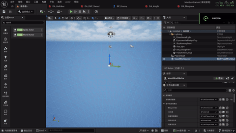
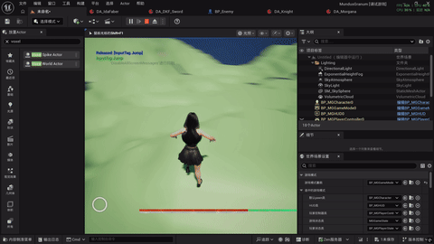

# 游戏演示
**学习路径：b站系列教程《虚幻5 C++ 游戏开发从入门到秃头》https://www.bilibili.com/video/BV1Wk9EYvEoy?t=5.6、《【虚幻引擎5】超硬核GAS游戏开发教程【完结】》https://www.bilibili.com/video/BV1L7JczbEwZ?t=8.2和Lyra源码。Lyra主要学习的部分是LyraCharacter和它的Component的模块化初始化流程**

## 角色移动

点击查看演示 GIF

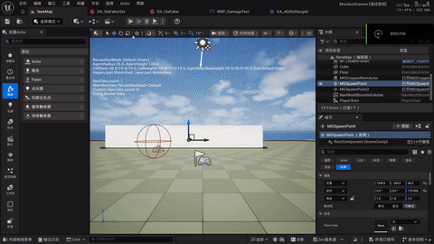

## 角色移动模式的状态机
声明FGameplayTagBlueprintPropertyMap类型的变量将一个标签与一个bool变量绑定。手持武器时切换动画蓝图。

点击查看演示 GIF

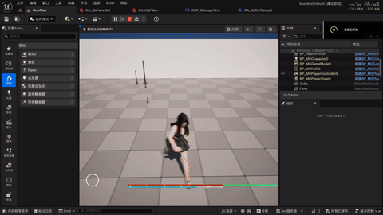

## 玩家背包与手持物品切换
没有做UI，gif中演示了空手和手持武器的切换

点击查看演示 GIF

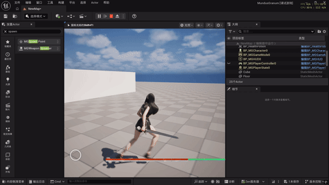

## 数据驱动的Character生成
派生一个ATargetPoint，角色的数据资产作为成员变量让TargetPoint在它的位置生成一个指定类型的Character，它的初始化流程融合进了玩家操控的Character的模块化初始化流程。

点击查看演示1 GIF

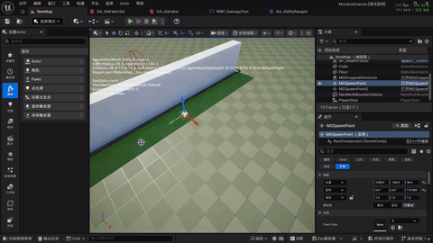

点击查看演示2 GIF

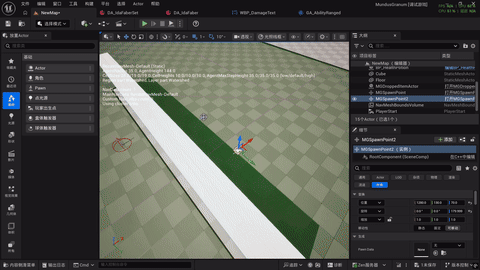

## 敌人AI

点击查看演示 GIF

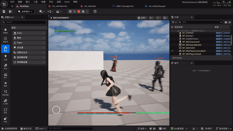

## 能力
GAS相关演示

### 跳跃能力

点击查看演示 GIF

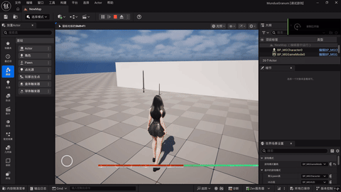

### 近战能力
缓存左右键标签组合，查找连招数据资产找到要跳转的Montage片段

点击查看玩家近战演示 GIF

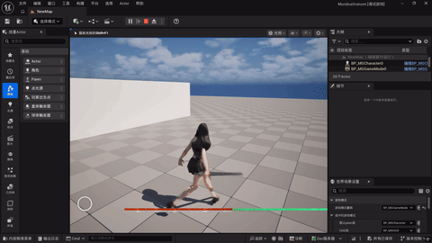
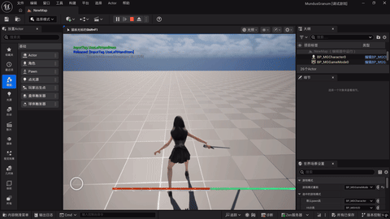
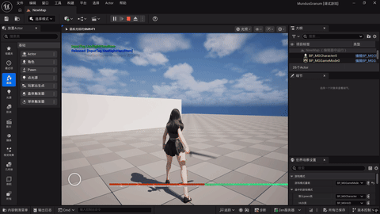

点击查看敌人近战演示 GIF

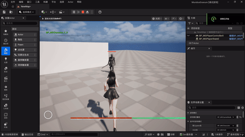

### 远程攻击

点击查看演示 GIF

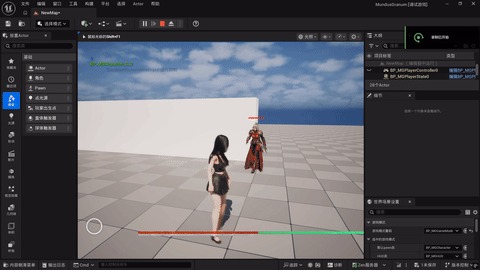

### 死亡

点击查看演示 GIF

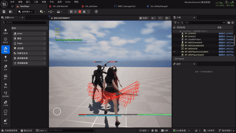

### 受击

点击查看演示 GIF

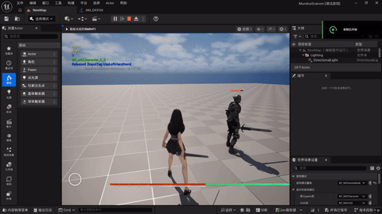

